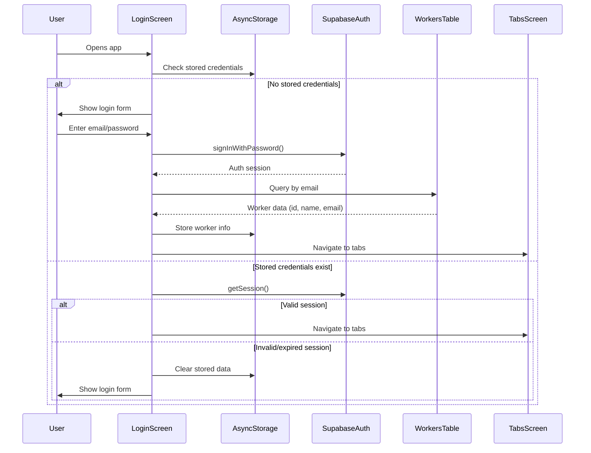
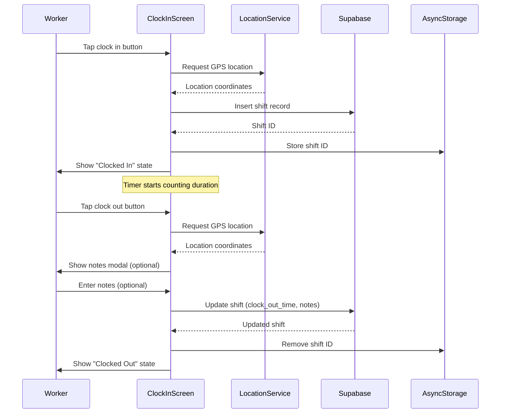
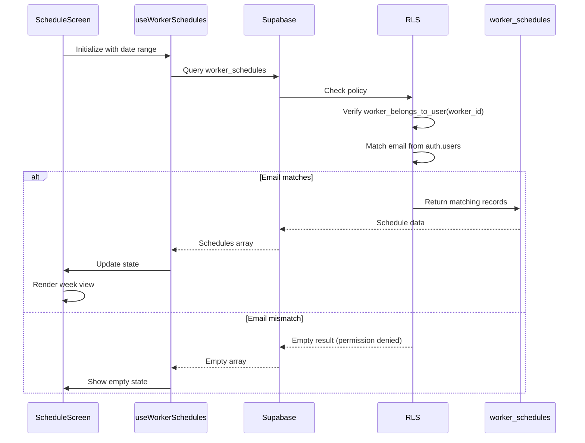
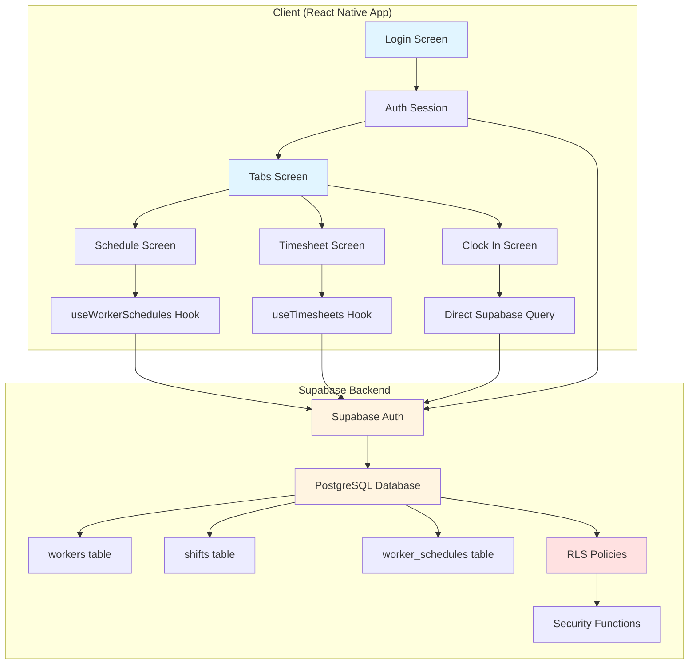

# Architecture Documentation

## Overview

VeraWorkerApp is a React Native mobile application built with Expo, designed for NDIS workers to clock in/out, view schedules, and manage timesheets. The app uses Supabase as the backend for authentication, database, and real-time data.

### Technology Stack

- **Framework**: Expo (~54.0.29) with React Native (0.81.5)
- **Routing**: Expo Router (file-based routing, ~6.0.21)
- **Backend**: Supabase (PostgreSQL database + Auth)
- **State Management**: React Hooks (useState, useEffect, custom hooks)
- **Storage**: AsyncStorage (native), browser localStorage (web)
- **Language**: TypeScript (5.9.2)

## System Requirements

### Prerequisites

- **Node.js**: v18.x or v20.x (LTS versions recommended)
- **npm**: v9.x or v10.x (comes with Node.js)
- **Git**: Latest version
- **Expo CLI**: Installed globally via `npm install -g expo-cli` (optional, but recommended)
- **EAS CLI**: Installed globally via `npm install -g eas-cli` (for builds)

### Platform-Specific Requirements

#### iOS Development
- **macOS**: Required for iOS development
- **Xcode**: Latest version (15.0+)
- **iOS Simulator**: Comes with Xcode
- **CocoaPods**: `sudo gem install cocoapods`
- **Apple Developer Account**: For TestFlight/App Store deployment

#### Android Development
- **Android Studio**: Latest version
- **Android SDK**: API Level 33 (Android 13) or higher
- **Android Emulator**: Configured in Android Studio
- **Java JDK**: Version 11 or higher

#### Web Development
- **Modern Browser**: Chrome, Firefox, Safari, or Edge
- No additional requirements

## First-Time Setup Guide

Follow these steps when setting up the project on a new device:

### 1. Clone the Repository

```bash
git clone https://github.com/jennofrie/VeraWorkerApp.git
cd VeraWorkerApp
```

### 2. Install Dependencies

```bash
npm install
```

**Expected time**: 2-5 minutes (depending on internet speed)

**Common issues**:
- If you get permission errors, use `sudo npm install` (macOS/Linux)
- If install fails, try deleting `node_modules/` and `package-lock.json`, then run `npm install` again

### 3. Configure Environment Variables

Create a `.env` file in the project root:

```bash
# .env file (do NOT commit this to git)
EXPO_PUBLIC_SUPABASE_URL="https://your-project.supabase.co"
EXPO_PUBLIC_SUPABASE_ANON_KEY="your-anon-key-here"
```

**Where to get these values**:
1. Go to your Supabase Dashboard
2. Navigate to: **Settings** → **API**
3. Copy **Project URL** (for `SUPABASE_URL`)
4. Copy **anon/public** key (for `SUPABASE_ANON_KEY`)

### 4. Set Up Database

You need to run SQL scripts in Supabase to create tables and RLS policies.

**Execution Order** (run in Supabase SQL Editor):

1. **Create tables** (if not exists):
   ```sql
   -- From README.md or run manually:
   -- Create workers table
   -- Create shifts table
   -- Create worker_schedules table
   ```

2. **Set up RLS policies** (run in this order):
   - `SQL/FIX_RLS_POLICIES.sql` - Workers table RLS
   - `SQL/FIX_SHIFTS_RLS.sql` - Shifts table RLS
   - `SQL/SETUP_WORKER_SCHEDULES_RLS.sql` - Schedules table RLS

3. **Optional migrations** (if needed):
   - `SQL/ADD_MISSING_SHIFT_COLUMNS.sql` - If upgrading from older version
   - `SQL/MIGRATE_WORKER_SCHEDULES_SCHEMA.sql` - If schedules table needs updates

### 5. Create Test Worker Account

In Supabase Dashboard:

1. Go to **Authentication** → **Users**
2. Click **"Add User"** → **"Create new user"**
3. Enter:
   - **Email**: `test@veralink.online`
   - **Password**: `TestPassword123!`
   - **Auto Confirm User**: ✅ Check this
4. Click **"Create User"**

Then add the worker to your `workers` table in **Table Editor**:

```sql
INSERT INTO workers (id, name, email)
VALUES (
  'your-uuid-here',  -- Use a UUID generator
  'Test Worker',
  'test@veralink.online'
);
```

**CRITICAL**: The email in `workers` table MUST match the email in Supabase Auth.

### 6. Start Development Server

```bash
npm start
```

**What happens**:
- Expo Dev Server starts on port 8081 (default)
- QR code appears in terminal
- Metro bundler starts
- Press keys to open different platforms:
  - `w` - Open in web browser
  - `i` - Open in iOS simulator (macOS only)
  - `a` - Open in Android emulator
  - `r` - Reload app

### 7. Verify Setup

Once the app loads:

1. **Login screen should appear**
2. Try logging in with test credentials
3. If you see "Permission denied" errors, check:
   - `.env` file exists and has correct values
   - RLS policies are created in Supabase
   - Worker exists in both `auth.users` and `workers` table with matching emails

## Project Structure

```
VeraWorkerApp/
├── app/                          # Expo Router file-based routes
│   ├── _layout.tsx              # Root layout with theme provider
│   ├── index.tsx                # Login screen (entry point)
│   ├── modal.tsx                # Modal route
│   └── (tabs)/                  # Tab group (hidden tab bar, drawer navigation)
│       ├── _layout.tsx          # Tab layout configuration
│       ├── index.tsx             # Home/Schedule screen
│       ├── schedule.tsx         # Schedule view (week-based)
│       ├── timesheet.tsx        # Timesheet view (week-based)
│       ├── clock-in.tsx         # Clock in/out screen
│       └── [other screens]      # Additional screens (about, availability, etc.)
│
├── components/                   # Reusable React components
│   ├── Drawer.tsx               # Drawer navigation wrapper
│   ├── DrawerContent.tsx        # Drawer menu with profile/logout
│   ├── ShiftNotesModal.tsx     # Modal for shift notes
│   ├── LocationMap.tsx         # Map component for location display
│   └── ui/                      # UI primitives (icons, collapsible)
│
├── hooks/                        # Custom React hooks
│   ├── useWorkerSchedules.ts    # Fetch worker schedules from Supabase
│   ├── useWorkerShifts.ts      # Fetch worker shifts from Supabase
│   ├── useTimesheets.ts        # Fetch timesheets from Supabase
│   └── [theme/color hooks]     # Theme and color scheme hooks
│
├── lib/                          # Core libraries and utilities
│   ├── supabase.ts             # Supabase client configuration
│   ├── authEvents.ts           # Auth event handling (if used)
│   └── utils/                   # Utility functions
│       ├── dateFormat.ts        # Date formatting helpers
│       ├── network.ts           # Network status detection
│       └── retry.ts             # Retry logic with exponential backoff
│
├── types/                        # TypeScript type definitions
│   └── schedule.ts              # WorkerSchedule interface
│
├── constants/                     # App constants
│   └── theme.ts                 # Theme colors and styling
│
├── assets/                       # Static assets
│   └── images/                   # Icons, logos, splash screens
│
├── SQL/                          # Database migration scripts
│   ├── FIX_RLS_POLICIES.sql     # RLS policy setup for workers
│   ├── SETUP_WORKER_SCHEDULES_RLS.sql  # RLS for schedules
│   ├── FIX_SHIFTS_RLS.sql       # RLS for shifts
│   └── [other migration scripts]
│
├── MarkDown/                     # Documentation files
│   ├── AUTH_MIGRATION_GUIDE.md
│   ├── [other documentation]
│   └── ARCHIVED_*               # Archived analysis documents
│
├── scripts/                      # Build and utility scripts
│   └── reset-project.js         # Project reset script
│
├── app.json                      # Expo configuration
├── package.json                  # Dependencies and scripts
├── tsconfig.json                 # TypeScript configuration
├── babel.config.js               # Babel configuration
├── eas.json                      # EAS Build configuration
└── README.md                     # Project documentation
```

## Core Architecture Patterns

### 1. Authentication Flow



**Key Components:**
- `app/index.tsx`: Login screen with email/password form
- `lib/supabase.ts`: Supabase client with auth configuration
- AsyncStorage keys: `@veralink:workerId`, `@veralink:workerName`, `@veralink:workerEmail`

**Security:**
- Email matching between `auth.users` and `workers` table
- RLS policies ensure workers can only read their own records
- Anonymous read access for login (before authentication)

### 2. Clock In/Out Flow



**Key Components:**
- `app/(tabs)/clock-in.tsx`: Clock in/out screen with animated button
- `components/ShiftNotesModal.tsx`: Modal for shift notes input
- `expo-location`: GPS location service
- AsyncStorage key: `@veralink:currentShiftId`

**Data Model:**
- `shifts` table: `id`, `worker_id`, `clock_in_time`, `clock_out_time`, `clock_in_lat`, `clock_in_lng`, `clock_out_lat`, `clock_out_lng`, `shift_notes`, `shift_duration`

### 3. Schedule Fetch Flow



**Key Components:**
- `hooks/useWorkerSchedules.ts`: Custom hook with retry logic
- `app/(tabs)/schedule.tsx`: Schedule screen with week navigation
- `types/schedule.ts`: WorkerSchedule interface

**Data Model:**
- `worker_schedules` table: `id`, `worker_id`, `scheduled_date`, `start_time`, `end_time`, `location_name`, `location_address`, `notes`, `status`, `actual_start_time`, `actual_end_time`

### 4. Data Flow Architecture



## Database Schema

### Tables

#### `workers`
- `id` (UUID, PRIMARY KEY): Worker unique identifier
- `name` (TEXT, NOT NULL): Worker display name
- `email` (TEXT, NOT NULL, UNIQUE): Worker email (must match auth.users.email)
- `created_at` (TIMESTAMPTZ): Record creation timestamp

#### `shifts`
- `id` (UUID, PRIMARY KEY): Shift unique identifier
- `worker_id` (UUID, NOT NULL, FOREIGN KEY): References workers(id) ON DELETE CASCADE
- `clock_in_time` (TIMESTAMPTZ, NOT NULL): Clock in timestamp
- `clock_in_lat` (DECIMAL): Clock in latitude
- `clock_in_lng` (DECIMAL): Clock in longitude
- `clock_out_time` (TIMESTAMPTZ): Clock out timestamp (nullable)
- `clock_out_lat` (DECIMAL): Clock out latitude
- `clock_out_lng` (DECIMAL): Clock out longitude
- `shift_notes` (TEXT): Optional shift notes
- `shift_duration` (TEXT): Calculated duration (e.g., "2h 30m")
- `created_at` (TIMESTAMPTZ): Record creation timestamp

#### `worker_schedules`
- `id` (UUID, PRIMARY KEY): Schedule unique identifier
- `worker_id` (UUID, NOT NULL, FOREIGN KEY): References workers(id)
- `scheduled_date` (DATE, NOT NULL): Scheduled date (YYYY-MM-DD)
- `start_time` (TIME, NOT NULL): Scheduled start time (HH:MM:SS)
- `end_time` (TIME, NOT NULL): Scheduled end time (HH:MM:SS)
- `location_name` (TEXT): Location name
- `location_address` (TEXT): Location address
- `notes` (TEXT): Schedule notes
- `status` (TEXT): 'BOOKED' | 'STARTED' | 'COMPLETED'
- `actual_start_time` (TIMESTAMPTZ): Actual clock in time
- `actual_end_time` (TIMESTAMPTZ): Actual clock out time
- `created_by` (UUID): Admin who created the schedule
- `created_at` (TIMESTAMPTZ): Record creation timestamp
- `updated_at` (TIMESTAMPTZ): Record update timestamp

## Security Model

### Row-Level Security (RLS)

All tables have RLS enabled to ensure data isolation between workers.

#### Workers Table Policies
1. **Anonymous Read**: Allows unauthenticated users to query workers table (needed for login)
2. **Authenticated Read by Email**: Authenticated users can only read their own worker record (email match)

#### Shifts Table Policies
1. **Workers can insert their own shifts**: `worker_belongs_to_user(worker_id)`
2. **Workers can update their own shifts**: `worker_belongs_to_user(worker_id)`
3. **Workers can read their own shifts**: `worker_belongs_to_user(worker_id)`

#### Worker Schedules Table Policies
1. **Workers can read their own schedules**: `worker_belongs_to_user(worker_id)`

### Security Functions

#### `get_auth_user_email()`
- **Type**: Security Definer Function
- **Purpose**: Safely retrieves authenticated user's email from `auth.users` table
- **Access**: Only accessible to authenticated role
- **Returns**: Email address (TEXT)

#### `worker_belongs_to_user(worker_uuid UUID)`
- **Type**: Security Definer Function
- **Purpose**: Validates that a worker UUID belongs to the authenticated user
- **Logic**: Checks if worker.email matches auth.users.email (case-insensitive)
- **Returns**: Boolean (true if worker belongs to user)

### Authentication Flow Security

1. **Login**: User authenticates with Supabase Auth (email/password)
2. **Worker Lookup**: App queries `workers` table by email (RLS allows authenticated read)
3. **Session Storage**: Worker ID, name, email stored in AsyncStorage (native) or localStorage (web)
4. **Subsequent Queries**: All database queries use authenticated session, RLS filters results automatically

## Environment Configuration

### Required Environment Variables

Create a `.env` file in the project root (not committed to git):

```bash
EXPO_PUBLIC_SUPABASE_URL=https://your-project.supabase.co
EXPO_PUBLIC_SUPABASE_ANON_KEY=your-anon-key-here
```

### Configuration Files

- `app.json`: Expo configuration (plugins, permissions, updates)
- `eas.json`: EAS Build configuration for iOS/Android
- `babel.config.js`: Babel transpilation configuration
- `tsconfig.json`: TypeScript compiler options

## Key Design Decisions

### 1. File-Based Routing (Expo Router)
- **Why**: Simplifies navigation, no manual route configuration
- **Structure**: `app/` directory mirrors route structure
- **Layouts**: `_layout.tsx` files define nested layouts

### 2. Custom Hooks for Data Fetching
- **Why**: Reusable logic, consistent error handling, retry logic
- **Pattern**: `useState` + `useEffect` (not React Query)
- **Hooks**: `useWorkerSchedules`, `useWorkerShifts`, `useTimesheets`

### 3. AsyncStorage for Session Persistence
- **Why**: Fast local storage, works offline
- **Limitation**: Web platform uses browser localStorage (handled in `lib/supabase.ts`)
- **Keys**: Prefixed with `@veralink:` for namespacing

### 4. Retry Logic with Exponential Backoff
- **Why**: Network reliability, timeout handling
- **Implementation**: `lib/utils/retry.ts`
- **Strategy**: 2 retries max, 1s initial delay, 4s max delay

### 5. Security Definer Functions for RLS
- **Why**: Safe access to `auth.users` table (regular users can't query it)
- **Pattern**: Functions run with elevated privileges, return safe data
- **Usage**: All RLS policies use these functions for email matching

### 6. Platform-Specific Implementations
- **Why**: Web and native platforms have different capabilities
- **Examples**: 
  - AsyncStorage (native) vs localStorage (web)
  - `Updates.reloadAsync()` (native) vs `window.location.href` (web)
  - Location permissions (different APIs)

## Error Handling Strategy

### Network Errors
- **Detection**: `lib/utils/network.ts` - `isNetworkError()`
- **Retry**: Automatic retry with exponential backoff
- **User Message**: "Network connection issue. Please check your internet and try again."

### Timeout Errors
- **Detection**: AbortController with configurable timeouts
- **Timeouts**: 5s (auth), 30s (schedules), 20s (other queries)
- **User Message**: "Request timed out. Please check your internet connection."

### Permission Errors
- **Detection**: Error code `PGRST301` or "permission denied" message
- **Action**: No retry (not recoverable)
- **User Message**: "Permission denied. Please ensure you are logged in."

### Database Errors
- **Detection**: Supabase error codes and messages
- **Action**: Log error, show user-friendly message
- **User Message**: Context-specific error messages

## Logout Implementation

### Problem
Expo Router has limitations navigating from Modal context (Drawer) to root route. `router.replace('/')` doesn't reliably update UI.

### Solution
Force app reload using `expo-updates`:
- **Production**: `Updates.reloadAsync()` - complete app restart
- **Development**: Fallback to `router.replace('/')` (may still have issues)
- **Web**: `window.location.href = '/'` - hard page reload

### Flow
1. User taps logout in Drawer
2. Clear AsyncStorage (worker credentials, preferences)
3. Sign out from Supabase Auth
4. Force app reload (native) or page reload (web)
5. App restarts, login screen shows (no stored credentials)

## Development Workflow

### Daily Development Process

1. **Start dev server**: `npm start`
2. **Make changes** in `app/`, `components/`, or `hooks/`
3. **Hot reload** automatically updates the app
4. **Test on platforms**: Use `i` (iOS), `a` (Android), `w` (web)
5. **Commit changes**: `git add .` → `git commit -m "message"` → `git push`

### Hot Reload Behavior

**Auto-reloads on**:
- Changes to `.tsx`, `.ts`, `.js` files
- Changes to `app.json` (requires full restart)
- Changes to `.env` (requires full restart)

**Requires manual restart**:
- Native dependency changes
- iOS/Android permission changes
- `package.json` updates

### Testing on Different Platforms

#### iOS Simulator (macOS only)
```bash
npm start
# Press 'i' in terminal
# Or: npm run ios
```

**Requirements**:
- Xcode installed
- iOS Simulator configured
- First run takes longer (installs Expo Go)

#### Android Emulator
```bash
npm start
# Press 'a' in terminal
# Or: npm run android
```

**Requirements**:
- Android Studio installed
- Emulator running (start from Android Studio)
- ADB configured in PATH

#### Web Browser
```bash
npm start
# Press 'w' in terminal
# Or: npm run web
```

**Limitations**:
- No native features (location, haptics, etc.)
- Good for UI/layout testing
- Different storage behavior (localStorage vs AsyncStorage)

#### Physical Device (Recommended)
1. Install **Expo Go** app from App Store/Play Store
2. Scan QR code from terminal
3. App loads on your device
4. Reflects real performance and features

## Build & Deployment

### Development
```bash
npm start          # Start Expo dev server
npm run web        # Start web version
npm run android    # Run on Android (dev build)
npm run ios        # Run on iOS (dev build)
```

### EAS Build Commands

#### iOS Builds

**Development Build** (for testing):
```bash
eas build --profile development --platform ios
```

**Preview Build** (TestFlight):
```bash
eas build --profile preview --platform ios
```

**Production Build** (App Store):
```bash
eas build --profile production --platform ios
eas submit --platform ios
```

#### Android Builds

**Development Build** (for testing):
```bash
eas build --profile development --platform android
```

**Preview Build** (internal testing):
```bash
eas build --profile preview --platform android
```

**Production Build** (Play Store):
```bash
eas build --profile production --platform android
eas submit --platform android
```

#### Both Platforms
```bash
eas build --profile production --platform all
```

### Build Configuration

#### EAS Build Profiles (`eas.json`)
- **development**: Local testing with simulator
- **preview**: Internal distribution (TestFlight/Play Testing)
- **production**: App Store/Play Store submission

#### Project Identifiers
- **Bundle ID (iOS)**: `com.veralink.worker`
- **Package Name (Android)**: `com.veralink.worker`
- **EAS Project ID**: `45c2c45a-57ad-495f-b20f-08a0fae226d6`
- **App Store ID**: `6756643841`

### Web Deployment (Netlify)

**Build command**: `npm run build`
**Output directory**: `dist/`

**Deploy steps**:
1. Netlify auto-deploys from `main` branch
2. Or manual: `netlify deploy --prod`

**Configuration**: See `netlify.toml` for build settings

## Dependencies

### Core Dependencies
- `expo`: Expo SDK (~54.0.29)
- `expo-router`: File-based routing (~6.0.21)
- `@supabase/supabase-js`: Supabase client (^2.86.2)
- `@react-native-async-storage/async-storage`: Local storage (2.2.0)
- `expo-location`: GPS location service (~19.0.8)
- `expo-updates`: OTA updates (~29.0.15)

### UI Dependencies
- `expo-linear-gradient`: Gradient backgrounds (~15.0.8)
- `expo-blur`: Blur effects (~15.0.8)
- `react-native-reanimated`: Animations (~4.1.1)
- `lucide-react-native`: Icons (^0.556.0)

## AsyncStorage Keys Reference

All AsyncStorage keys used in the app (prefixed with `@veralink:`):

| Key | Type | Purpose | Stored On | Cleared On |
|-----|------|---------|-----------|------------|
| `@veralink:workerId` | UUID | Worker's unique ID from workers table | Login | Logout |
| `@veralink:workerName` | string | Worker's display name | Login | Logout |
| `@veralink:workerEmail` | string | Worker's email address | Login | Logout |
| `@veralink:currentShiftId` | UUID | Active shift ID (if clocked in) | Clock In | Clock Out |
| `@veralink:shiftNotifications` | boolean | Notification preference | Settings | Logout |
| `@veralink:profilePhoto` | URI string | Profile photo URI | Profile Edit | Logout |
| `@veralink:displayName` | string | Custom display name | Profile Edit | Logout |

**Note**: Web platform uses `localStorage` instead of `AsyncStorage` (handled automatically in `lib/supabase.ts`).

## Database Setup Details

### Table Creation Order

1. **workers** table (no dependencies)
2. **shifts** table (depends on workers)
3. **worker_schedules** table (depends on workers)

### SQL Migration Scripts (Execute in Order)

#### Initial Setup
1. Create tables manually or use schema from README.md
2. **`SQL/FIX_RLS_POLICIES.sql`**: Workers table RLS + security functions
3. **`SQL/FIX_SHIFTS_RLS.sql`**: Shifts table RLS
4. **`SQL/SETUP_WORKER_SCHEDULES_RLS.sql`**: Worker schedules RLS

#### Optional Migrations (Run if needed)
- **`SQL/ADD_MISSING_SHIFT_COLUMNS.sql`**: Adds location/duration columns if missing
- **`SQL/MIGRATE_WORKER_SCHEDULES_SCHEMA.sql`**: Updates worker_schedules schema
- **`SQL/FIX_FOREIGN_KEY.sql`**: Fixes invalid worker_id references
- **`SQL/CREATE_WORKER_SCHEDULES_UPDATE_RLS.sql`**: Adds update policies for schedules

### Security Functions Created

Both functions are created by `FIX_RLS_POLICIES.sql`:

1. **`public.get_auth_user_email()`**
   - Returns authenticated user's email from auth.users
   - Used by all RLS policies

2. **`public.worker_belongs_to_user(worker_uuid UUID)`**
   - Validates worker ownership by email matching
   - Returns boolean (true if worker belongs to authenticated user)

## Troubleshooting Common Issues

### Issue: "Permission denied for table workers"

**Cause**: RLS policies not set up or incorrect email matching

**Solution**:
1. Run `SQL/FIX_RLS_POLICIES.sql` in Supabase SQL Editor
2. Verify email matches exactly between `auth.users` and `workers` table:
   ```sql
   SELECT au.email AS auth_email, w.email AS worker_email
   FROM auth.users au
   FULL OUTER JOIN workers w ON LOWER(au.email) = LOWER(w.email)
   WHERE au.email = 'your-test-email@example.com';
   ```
3. If emails don't match, update workers table:
   ```sql
   UPDATE workers SET email = 'correct-email@example.com' WHERE id = 'worker-uuid';
   ```

### Issue: "Failed to fetch" on login (web)

**Cause**: Missing or invalid Supabase credentials

**Solution**:
1. Check `.env` file exists in project root
2. Verify credentials are correct (no extra quotes/spaces)
3. Restart dev server: `Ctrl+C`, then `npm start`
4. Check browser console for specific error
5. Verify Supabase URL allows CORS from localhost

### Issue: "Request timed out"

**Cause**: Network timeout (Supabase query taking too long)

**Solution**:
1. Check internet connection
2. Verify Supabase project is not paused (free tier auto-pauses)
3. Check Supabase status page: https://status.supabase.com
4. Increase timeout in `lib/supabase.ts` if needed (currently 5s/20s/30s)

### Issue: Logout doesn't work (stays on same screen)

**Cause**: Known Expo Router limitation (Modal → root navigation)

**Solution**:
- **Production**: Already fixed with `expo-updates` reload
- **Development (Expo Go)**: Expected behavior, will work in production builds
- **Web**: Should work with hard reload

### Issue: Location permissions denied

**iOS**:
1. Go to: **Settings** → **Privacy** → **Location Services**
2. Find **Expo Go** or your app
3. Select **"While Using the App"**

**Android**:
1. Go to: **Settings** → **Apps** → **Expo Go** or your app
2. Tap **Permissions** → **Location**
3. Select **"Allow only while using the app"**

### Issue: EAS Build fails

**Common causes**:
1. **Missing credentials**: Run `eas credentials`
2. **Invalid app.json**: Check JSON syntax
3. **Dependency conflicts**: Try `npm install --force`
4. **Cache issues**: Run `eas build --clear-cache`

### Issue: App crashes on startup

**Check**:
1. **Logs**: Run `npx expo start` and check terminal output
2. **Supabase config**: Verify `.env` file is valid
3. **AsyncStorage**: Try clearing app data/cache
4. **Network**: Ensure device/simulator has internet

## Debugging Guide

### Enable Debug Logging

Add to your code temporarily:
```typescript
if (__DEV__) {
  console.log('Debug info:', yourVariable);
}
```

### Platform-Specific Debugging

#### iOS (Xcode Console)
1. Open Xcode
2. Window → Devices and Simulators
3. Select your device/simulator
4. Click **Open Console**
5. Filter by "Expo" or your app name

#### Android (Logcat)
```bash
adb logcat | grep "ReactNativeJS"
```

Or in Android Studio: **Logcat** panel at bottom

#### Web (Browser DevTools)
- **Chrome**: F12 → Console tab
- **Firefox**: F12 → Console tab
- **Safari**: Develop → Show JavaScript Console

### Remote Debugging

**React Native Debugger** (recommended):
1. Install: `brew install --cask react-native-debugger` (macOS)
2. Run: `open "rndebugger://set-debugger-loc?host=localhost&port=8081"`
3. In app: Shake device → "Debug Remote JS"

### Network Debugging

**Supabase queries**:
```typescript
// Add this to see exact query
const { data, error } = await supabase
  .from('workers')
  .select('*')
  .eq('email', email);

console.log('Supabase response:', { data, error });
```

**Axios/Fetch**: Use browser DevTools → Network tab

## Quick Reference Commands

### Git Commands
```bash
git status                    # Check current changes
git pull origin main          # Pull latest from GitHub
git add .                     # Stage all changes
git commit -m "message"       # Commit changes
git push origin main          # Push to GitHub
git log --oneline -10         # View recent commits
```

### Expo/React Native
```bash
npm start                     # Start dev server
npm run ios                   # Run iOS simulator
npm run android               # Run Android emulator
npm run web                   # Run in browser
npx expo start --clear        # Clear cache and start
npx expo install              # Install/update Expo packages
```

### EAS Commands
```bash
eas login                     # Login to EAS
eas build --platform ios      # Build for iOS
eas build --platform android  # Build for Android
eas submit --platform ios     # Submit to App Store
eas update                    # Push OTA update
```

### Troubleshooting
```bash
rm -rf node_modules package-lock.json  # Clean dependencies
npm install                            # Reinstall dependencies
npx expo start --clear                 # Clear Metro cache
watchman watch-del-all                 # Clear watchman cache (macOS)
```

## Future Considerations

### Potential Improvements
1. **Real-time Updates**: Supabase subscriptions for schedule changes
2. **Offline Support**: Service workers, local database sync
3. **Push Notifications**: FCM/APNs for shift reminders
4. **Enhanced Error Recovery**: Automatic retry with user notification
5. **Performance**: React Query for better caching and state management

### Known Limitations
1. **Development Logout**: May still have navigation issues in Expo Go
2. **Web AsyncStorage**: Requires polyfill considerations
3. **No Offline Mode**: Requires internet connection for all operations

---

**Last Updated**: 2025-12-26  
**Version**: 1.0.0

